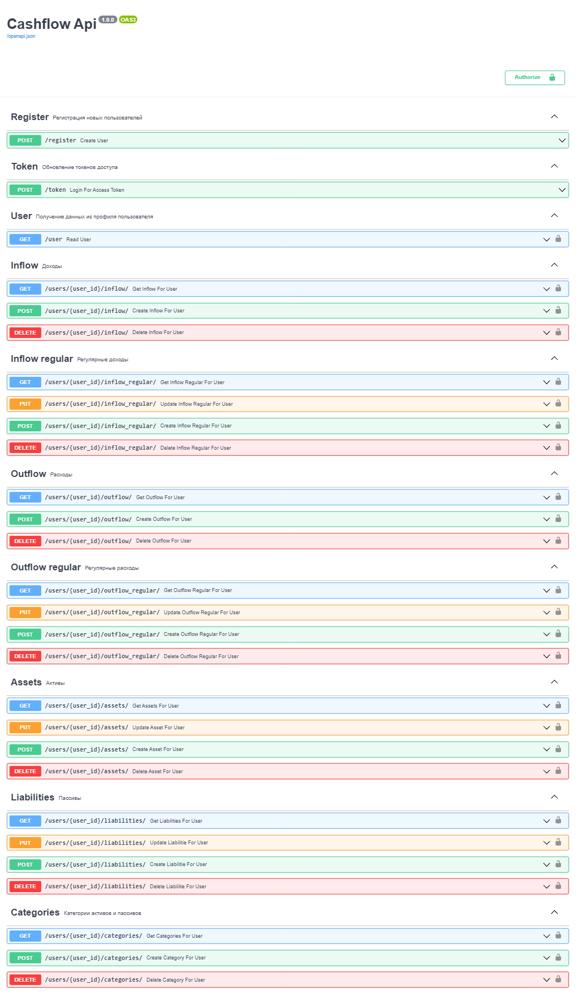

# CashFlow

Backend сервиса Cashflow для контроля доходов и расходов ("Денежный поток").
Написан на Python с использованием FastAPI и Sqlalchemy/PostgreSQL. 

Frontend здесь https://github.com/darkavengersmr/CashFlowUI

